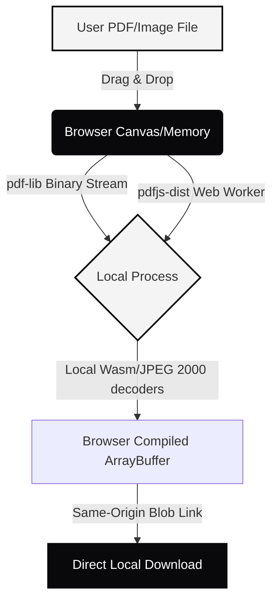

# 🔒 ZeroWebTools

> **Zero Server Uploads. Zero Latency. Zero Tracking. 100% Client-Side Browser Execution.**

**ZeroWebTools** is a premium, locally-first, open-source suite of secure web tools designed for developers, creators, and modern builders. Crafted in a **Swiss Minimalist** design language (grayscale accents, modular typography, and spacious layouts), the platform runs entirely inside the user's browser sandbox context using WebAssembly (WASM) and client-side JavaScript. 

No files, raw bytes, or user data are ever uploaded, processed, or cached on any remote servers—guaranteeing **absolute privacy** and **instantaneous offline execution**.

---

## 🚀 Key Pillars

1. **Absolute Privacy & Sandboxing**: All PDF processing, image resizing, Base64 conversions, and mathematical modeling run completely in the client's browser engine.
2. **Swiss Minimalist Aesthetic**: A stark, professional visual style featuring solid grayscale tokens (#09090b light / #f4f4f5 dark), subtle active border highlights, spaced dash-bordered grids, and premium micro-interactions.
3. **High-Performance WebAssembly**: Outfitted with dynamic client-side decoders for complex official documents (like e-Aadhaar cards or protected statements), processing standard structures, JPEG 2000 (`/JPXDecode`) streams, and custom formats locally.
4. **Instant Offline Speed**: Loads in milliseconds and continues working without a network connection.

---

## 🛠️ The Tool Suite

### 1. PDF Suite Pro (Local PDF Workbench)
*   **Merge PDF**: Combine multiple PDFs into a single document in any order with drag-and-drop file reordering.
*   **Split PDF**: Extract page selections or range streams cleanly into optimized single sheets or custom packages.
*   **Compress PDF**: Real-time visual compression supporting three distinct target levels:
    *   *Balanced Compression (150 DPI)*: High-ratio visual downscaling (up to 90% space savings) with crisp visuals.
    *   *Extreme Compression (100 DPI)*: High-compression JPEG rendering for strict portal size limits.
    *   *Lossless Optimization*: Stream structure stripping and metadata cleaning (preserves searchable text and sharp vectors).
*   **Protect PDF**: Fast, standard password encryption (128-bit/Revision 3 RC4) writing custom trailer dictionaries.
*   **Unlock PDF**: Remove password locks from files you own.
*   **Organize PDF**: Visually rearrange, rotate, or delete individual pages inside the browser grid.
*   **Watermark PDF**: Embed text stamps (e.g. `CONFIDENTIAL`) with dynamic opacity, scale, and angles.
*   **Page Numbers**: Stamp page indicators dynamically (top, bottom, right, center) with customized indexes.
*   **PDF to JPG & JPG to PDF**: High-fidelity cross-conversions.

### 2. Creative & Format Utilities
*   **Image Resizer**: Adjust image bounds and compress formats (PNG/JPEG/WEBP) in browser memory.
*   **HEIC to JPG/PNG**: Fast client-side translation of Apple's high-efficiency image container formats.

### 3. Growth & Financial Modelers
*   **MRR/ARR Growth Modeler**: Interactive recurring revenue modeler for SaaS builders to forecast growth paths.
*   **SaaS Valuation Calculator**: Input key metrics to assess SaaS enterprise values instantly.

---

## ⚡ Tech Stack

*   **Core framework**: React 19 & [Next.js 15](https://nextjs.org/) (App Router)
*   **Styling System**: Tailwind CSS & Vanilla CSS modules (Grayscale visual design token theme)
*   **Motion & Animation**: Framer Motion (Smooth, springs, page view transitions, and typewriter effects)
*   **PDF Engine**: `pdf-lib` (Binary stream writer) & `pdfjs-dist` (High-fidelity canvas page renderer)
*   **Encryption System**: `@pdfsmaller/pdf-encrypt-lite` (Lightweight Browser Standard encryption)

---

## 🔧 Local Development & Setup

### Prerequisites
*   Node.js >= 18.17.0
*   npm >= 9.0.0

### Installation
Clone the repository and install the workspaces' packages:
```bash
git clone https://github.com/your-username/zerowebtools.git
cd zerowebtools
npm install
```

### Static Asset Configurations (PDFJS Decoders)
To compile scanned official PDF layers (like JPEG 2000 `/JPXDecode` images) successfully in secure local environments, the Web Worker and WASM decoders are served directly from the same origin. 

Ensure the assets are copied into the web application's public assets folder:
```bash
# Copies workers and WebAssembly modules from npm package to public directory
cp node_modules/pdfjs-dist/build/pdf.worker.min.mjs apps/web/public/pdf.worker.min.js
mkdir -p apps/web/public/wasm
cp node_modules/pdfjs-dist/wasm/* apps/web/public/wasm/
```

### Run the Development Server
Start the local Next.js workspace server:
```bash
npm run dev:web
```
Open [http://localhost:3000](http://localhost:3000) in your browser to interact with the workbench.

### Build and Static Compile
Validate and build the production-ready optimized bundles:
```bash
npm run build:web
```

---

## 🔒 Security & Sandboxing Architecture

Unlike standard online web tool utilities that stream user files to remote servers (incurring privacy exposure, bandwidth bottlenecks, and security vulnerabilities), **ZeroWebTools** maintains a zero-trust architecture:



*   **Zero Server Streams**: Files never exit your browser's execution memory context.
*   **Isolated Web Workers**: Heavy canvas decoders load inside background worker sandboxes of the same origin.
*   **Blob URL Generators**: Temporary download links exist solely inside browser session windows, self-destructing instantly on tab close.

---

## 📄 License

Distributed under the MIT License. See `LICENSE` for more information.
