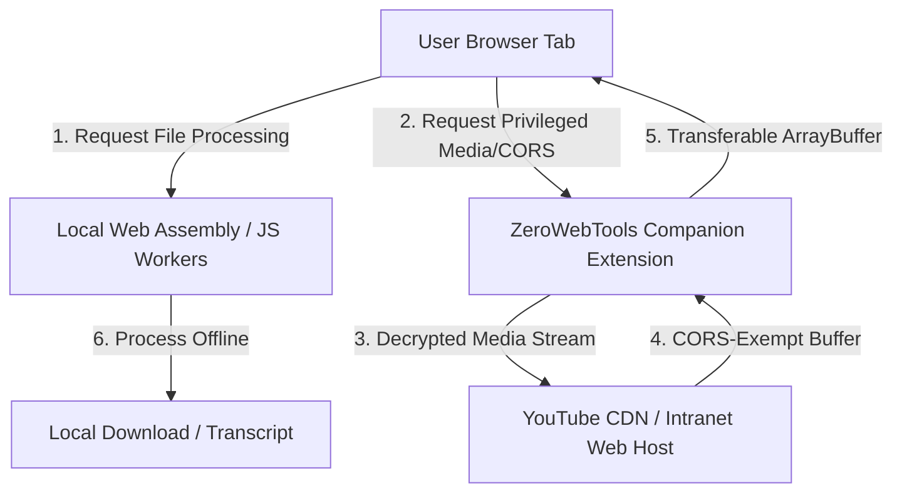

# 📚 ZeroWebTools Documentation Index

Welcome to the official developer and design documentation for **ZeroWebTools**—the offline-first, 100% client-side web utility platform. 

This directory contains detailed architecture guides and system blueprints for the platform.

---

## 🗂️ Documentation Guide

| Document | Description | Target Audience |
|----------|-------------|-----------------|
| [🏠 Project README](file:///Users/zee/zeeshanahmad-io/zerowebtools/README.md) | Core repository overview, tool list, and local build instructions. | All Developers |
| [🌍 Translation Workflow](file:///Users/zee/zeeshanahmad-io/zerowebtools/docs/translation_workflow.md) | Guide to our Google Translate automated i18n compilation script for SEO queries and UI dictionaries. | Localization / i18n |
| [📝 Medium Parser Logic](file:///Users/zee/zeeshanahmad-io/zerowebtools/docs/medium_parser_logic.md) | Explanation of the local parser logic to scrape and read Medium articles in-browser. | Developers |

---

## 🏗️ Core Architecture Overview

### Key Technical Pillars:
1. **Zero Server Uploads**: Processing is strictly local using Web Workers, OfflineAudioContext, and WebAssembly (`@xenova/transformers`, `FFmpeg.wasm`).
2. **Monorepo Workspaces**: Standardized code sharing between Next.js frontend (`apps/web`) and extension popups (`apps/extensions/developertools`) through shared logic package (`packages/tools-core`).
3. **Organic Growth Loops**: Premium browser features (like YouTube transcription and scraping) prompt users to install the free Companion browser extension, driving Chrome Web Store volume organically.
