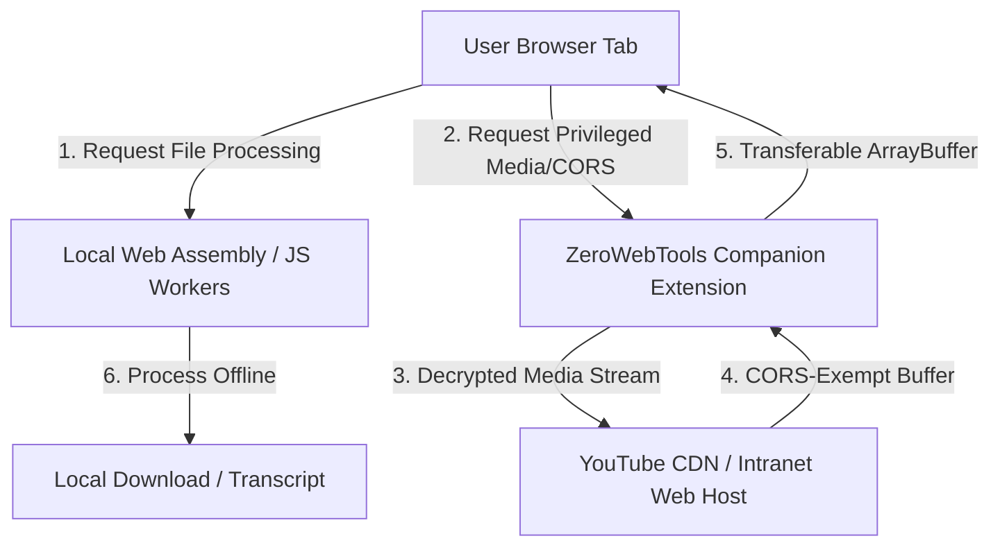

# 📚 ZeroWebTools Documentation Index

Welcome to the official developer and design documentation for **ZeroWebTools**—the offline-first, 100% client-side web utility platform. 

This directory contains detailed architecture guides, launch plans, translation pipelines, and system proposals for upcoming features.

---

## 🗂️ Documentation Guide

| Document | Description | Target Audience |
|----------|-------------|-----------------|
| [🏠 Project README](file:///Users/zee/zeeshanahmad-io/zeelancebox/README.md) | Core repository overview, tool list, and local build instructions. | All Developers |
| [🏆 Completed Milestones](file:///Users/zee/zeeshanahmad-io/zeelancebox/docs/completed_milestones.md) | Retrospective of built features, coverage reports, and structural monorepo layout. | Maintainers |
| [📅 Future Plans & Roadmap](file:///Users/zee/zeeshanahmad-io/zeelancebox/docs/future_plans.md) | Step-by-step launch, analytics log table setup, AdSense integrations, and service worker configs. | Product & Ops |
| [🌍 Translation Workflow](file:///Users/zee/zeeshanahmad-io/zeelancebox/docs/translation_workflow.md) | Guide to our Google Translate automated i18n compilation script for SEO queries and UI dictionaries. | Localization / i18n |
| [⚡ Companion Extension Proposal](file:///Users/zee/zeeshanahmad-io/zeelancebox/docs/extension_companion_proposal.md) | Technical and UI/UX specification of the **ZeroWebTools Companion** Chrome/Firefox extension. | Extension Devs |
| [🚀 Extension Tools Roadmap](file:///Users/zee/zeeshanahmad-io/zeelancebox/docs/extension_tools_roadmap.md) | Detailed architecture, mockups, and client-side hacks for the high-traction privileged tools (YouTube Downloader, Scraper, REST Client). | System Designers |
| [🧠 AI Extension Tools Brainstorm](file:///Users/zee/zeeshanahmad-io/zeelancebox/docs/ai_extension_tools_brainstorm.md) | Architectural concepts and design ideas for specialized, serverless client-side AI tools (Semantic Search, Summarizer, Job Matcher). | Product & AI Devs |

---

## 🏗️ Core Architecture Overview

### Key Technical Pillars:
1. **Zero Server Uploads**: Processing is strictly local using Web Workers, OfflineAudioContext, and WebAssembly (`@xenova/transformers`, `FFmpeg.wasm`).
2. **Monorepo Workspaces**: Standardized code sharing between Next.js frontend (`apps/web`) and extension popups (`apps/extensions/developertools`) through shared logic package (`packages/tools-core`).
3. **Organic Growth Loops**: Premium browser features (like YouTube transcription and scraping) prompt users to install the free Companion browser extension, driving Chrome Web Store volume organically.
