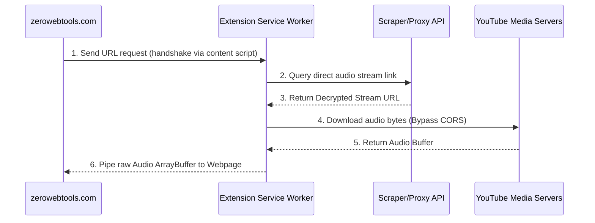

# Design Proposal: ZeroWebTools Companion Extension

This document outlines the visual design, UX behaviors, and technical architecture for expanding and rebranding our existing extension into the **ZeroWebTools Companion**.

---

## 🌟 Visual Philosophy: "Sleek Chrome Overlay"

The extension popup and options pages will inherit the same premium **Swiss Minimalist** style of the main website—monochromatic HSL-tailored dark mode, Geist/Inter typography, and subtle royal violet/indigo highlights (`hsl(247, 89%, 60%)`).

```
┌────────────────────────────────────────┐
│ ⚡ ZeroWebTools Companion   [🟢 Active] │
├────────────────────────────────────────┤
│  ┌─┐  ┌─┐  ┌─┐  ┌─┐  ┌─┐  ┌─┐  ┌─┐     │
│  │J│  │D│  │W│  │C│  │B│  │U│  │⚙️│     │
│  └─┘  └─┘  └─┘  └─┘  └─┘  └─┘  └─┘     │
│  JSON Diff Word Case B64 URL Settings  │
├────────────────────────────────────────┤
│                                        │
│  [ JSON Formatter Workspace ]          │
│  Paste JSON, format or view tree...    │
│                                        │
├────────────────────────────────────────┤
│ 🔒 100% Private & Local Offline Mode   │
└────────────────────────────────────────┘
```

### 1. The Toolbar Popup (Dimensions: 380px × 540px)
* **Status Bar Header**: Displays a clean connection indicator: `🟢 ZeroWebTools Companion Active` if connected to `zerowebtools.com` or `localhost`.
* **Dynamic Tab Grid**: Clean row of monochromatic icon buttons at the top to toggle between the developer utilities:
  * **JSON**: JSON Formatter
  * **Diff**: Side-by-side Diff Checker
  * **Word**: Word Counter
  * **Case**: Case Converter
  * **B64**: Base64 Cipher
  * **URL**: URL Encoder
  * **Settings**: Link to the Extension Options page.
* **Workspace Content Frame**: Interactive content panel rendering the active utility tool.

### 2. The Options Page (Full Tab Dashboard)
A complete page dashboard rendered in a browser tab (`chrome-extension://.../options.html`):
* Left sidebar for category navigation (General, Integrations, Storage, About).
* Right content panel featuring toggle switches for integrations, textboxes for custom API endpoints, and storage gauges showing cached file usage.

---

## ⚡ Extension Capabilities (The "Power-Ups")

By utilizing the extension companion, the main website unlocks advanced browser privileges:



### 1. YouTube & Media Audio Extraction
* **The Workflow**:
  1. User enters a YouTube link on the website's Audio Transcriber tool.
  2. The website detects the extension and makes a proxy call: `{ action: "FETCH_YOUTUBE_AUDIO", url: "..." }`.
  3. The extension's service worker queries a public proxy scraper API (like Invidious or Piped) to get the direct decrypted audio stream URL.
  4. The extension downloads the audio stream data as an `ArrayBuffer` (exempt from browser CORS constraints).
  5. The extension passes the raw audio buffer back to the web page for local resampling (16kHz mono) and Whisper transcription.

### 2. Universal CORS Proxy Scraping
* **The Workflow**:
  1. User pastes an external URL to read a PDF or text document.
  2. The website requests the extension: `{ action: "PROXY_FETCH", url: "..." }`.
  3. The extension fetches the resource directly (ignoring CORS headers) and returns the document stream to the web tab.

### 3. Context Menu Integrations (Right-Click Actions)
Registers context menus in Chrome:
* **"ZeroWebTools: Format JSON"**: Right-clicking selected text immediately decodes, formats, and opens it inside our web app's JSON Formatter tab.
* **"ZeroWebTools: Clean Text"**: Send selected paragraphs to our Text Cleaner workspace.
* **"ZeroWebTools: Transcribe Selection"**: Send audio links directly to the Audio Transcriber.

### 4. Unlimited Local Cache Storage
* Bypasses the browser's standard `localStorage` 5MB limit by leveraging the extension's `unlimitedStorage` permission to cache user transcripts, settings, and file history templates securely.

---

## ⚙️ Manifest configuration (`manifest.json`)

To enable cross-context communication and bypass security limitations, the Companion extension is configured with specific API permissions:

```json
{
  "manifest_version": 3,
  "name": "ZeroWebTools Companion",
  "version": "1.0.0",
  "description": "Unlock advanced client-side utilities including private YouTube transcriber, CORS bypass proxies, and local REST debugging tools.",
  "permissions": [
    "unlimitedStorage",
    "contextMenus",
    "activeTab"
  ],
  "host_permissions": [
    "*://*.youtube.com/*",
    "*://*.googlevideo.com/*",
    "*://*.ytimg.com/*"
  ],
  "background": {
    "service_worker": "background.js",
    "type": "module"
  },
  "externally_connectable": {
    "matches": [
      "https://zerowebtools.com/*",
      "https://www.zerowebtools.com/*",
      "http://localhost/*"
    ]
  }
}
```

---

## 🤝 Handshake & Extension Detection

To determine if the user has the Companion extension installed, the website uses a hybrid detection approach.

### 1. DOM-Based Detection (Synchronous)
A content script runs at `document_start` and injects a custom data attribute onto the root HTML element. The website can query this instantly without asynchronous delays:

**Content Script (`content.js`):**
```javascript
document.documentElement.setAttribute("data-zerowebtools-companion", "1.0.0");
```

**Website Check (`src/hooks/useCompanion.ts`):**
```typescript
export function isCompanionInstalled(): boolean {
  if (typeof window === "undefined") return false;
  return document.documentElement.hasAttribute("data-zerowebtools-companion");
}
```

### 2. Message-Based Ping (Asynchronous Validation)
The website sends a lightweight handshake message. If it resolves, the connection is confirmed:

```typescript
export async function pingCompanion(extensionId: string): Promise<boolean> {
  if (typeof window === "undefined" || !window.chrome?.runtime?.sendMessage) {
    return false;
  }
  
  return new Promise((resolve) => {
    try {
      chrome.runtime.sendMessage(extensionId, { action: "PING" }, (response) => {
        if (chrome.runtime.lastError) {
          resolve(false);
        } else {
          resolve(response?.status === "PONG");
        }
      });
    } catch {
      resolve(false);
    }
  });
}
```

---

## 📨 Message Passing Schemas

### 1. `FETCH_YOUTUBE_AUDIO`

**Request Payload:**
```json
{
  "action": "FETCH_YOUTUBE_AUDIO",
  "videoId": "dQw4w9WgXcQ",
  "quality": "lowest"
}
```

**Response Payload:**
```json
{
  "status": "SUCCESS",
  "data": {
    "arrayBuffer": [0, 15, 34, 12, 109, "..."], // Array of numbers representing raw bytes
    "contentType": "audio/webm",
    "duration": 212
  }
}
```

### 2. `PROXY_FETCH`

**Request Payload:**
```json
{
  "action": "PROXY_FETCH",
  "url": "https://example.com/document.pdf",
  "headers": {
    "Accept": "application/pdf"
  }
}
```

**Response Payload:**
```json
{
  "status": "SUCCESS",
  "data": {
    "arrayBuffer": [37, 80, 68, 70, "..."], // Raw file buffer (PDF header %PDF)
    "contentType": "application/pdf"
  }
}
```

---

## 🔒 Security & Sandboxing (CORS Security Filters)

Because the extension has host permissions to bypass CORS, we must prevent unauthorized origins from calling privileged API methods:

1. **Origin Verification**: The background service worker checks the sender's origin on every message:
   ```javascript
   chrome.runtime.onMessageExternal.addListener((message, sender, sendResponse) => {
     const trustedOrigins = [
       "https://zerowebtools.com",
       "https://www.zerowebtools.com"
     ];
     
     // Allow localhost during local development
     if (process.env.NODE_ENV === "development" || sender.origin.startsWith("http://localhost")) {
       trustedOrigins.push(sender.origin);
     }

     if (!sender.origin || !trustedOrigins.includes(sender.origin)) {
       console.error("Untrusted origin blocked:", sender.origin);
       return sendResponse({ error: "Access Denied: Untrusted origin" });
     }
     
     // Route whitelist action...
     handleTrustedMessage(message, sender, sendResponse);
     return true; // Keep message channel open for async response
   });
   ```
2. **Action Whitelisting**: Only whitelisted actions (`PING`, `FETCH_YOUTUBE_AUDIO`, `PROXY_FETCH`) are executed.
3. **Input Sanitization**: URLs are checked to ensure they match standard protocols (`http:`, `https:`) and are parsed using the browser's `URL` constructor to block `javascript:` injections.
