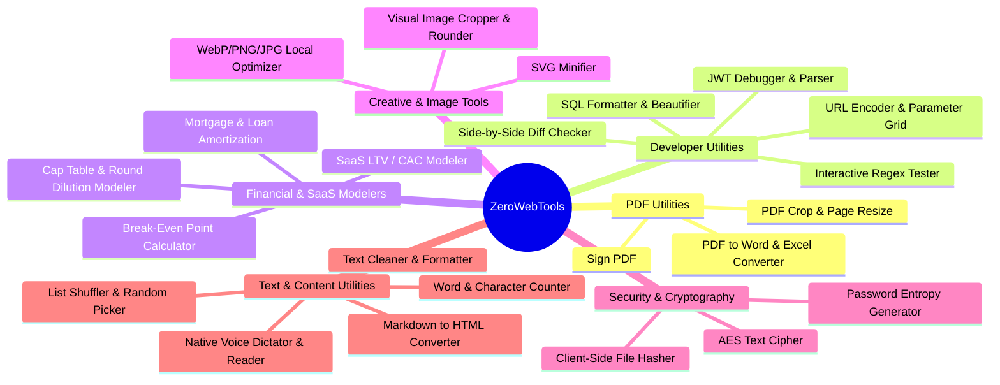

# 🚀 ZeroWebTools: High-Traffic & High-CPM Tool Roadmap

To maximize Google AdSense revenue, our roadmap focuses on tools that meet three critical criteria:
1. **High Monthly Search Volume (SEO Value)**: High-intent organic queries that drive consistent traffic.
2. **High-CPC/CPM Ad Niches**: Topics (such as business finance, enterprise software, data security, and PDF administration) that command premium advertiser bids.
3. **100% Client-Side Execution (Zero Server Cost)**: Fits the ZeroWebTools brand values (absolute privacy, offline-first) and costs $0 in backend server processing.

---

## 🗺️ High-Value Tool Categorization

---

## 📄 1. PDF Utilities (High Traffic, High Retention)
PDF management is one of the highest search volume niches on the web (e.g., Smallpdf and iLovePDF generate tens of millions of monthly visits). B2B advertisers place highly competitive bids in this category.

### 🌟 Proposed Additions:

#### A. **Sign PDF**
* **Why**: High volume searches. Critical for remote workers, freelancers, and businesses.
* **Functionality**:
  * Upload a PDF and render pages onto an interactive canvas.
  * Draw a signature, type a signature (using elegant script fonts), or upload an image signature.
  * Place, resize, and position the signature on any page.
  * Save and export the signed PDF locally using `pdf-lib`.
* **Revenue potential**: Very high. Attracts enterprise-level software (DocuSign, Adobe, PandaDoc) ads.

#### B. **PDF Crop & Page Resize**
* **Why**: Users often need to crop borders or format pages to specific standard sizes (A4, Letter) for printing.
* **Functionality**:
  * Drag selectors to visually crop pages.
  * Change crop boxes, media boxes, and view boxes of pages locally.
  * Adjust margins, padding, and page alignments.

#### C. **PDF to Excel & PDF to Word (Text Extractor)**
* **Why**: Massive traffic volume.
* **Functionality**:
  * Parse PDF text layers using `pdfjs-dist`.
  * Rebuild tabular rows using spacing heuristics and export as `.csv` or `.xlsx` (using a client-side library like `xlsx` or `sheetjs`).
  * Reconstruct paragraphs into standard `.docx` layout streams.

---

## 🛠️ 2. Developer & Technical Utilities (High Traffic, B2B Ad Placement)
Developers and IT professionals use these daily. Tech advertisers (SaaS products, cloud hosting providers, APM platforms) pay some of the highest CPCs to display ads to this audience.

### 🌟 Proposed Additions:

#### A. **JWT Debugger & Decoder**
* **Why**: High search volume and high B2B ad bids.
* **Functionality**:
  * Input a JSON Web Token (JWT) and instantly split it into Header, Payload, and Signature.
  * Beautify JSON payloads with color-coded syntax.
  * Calculate token expiration time in local timezone and show dynamic countdown timers.
  * Verify token signatures client-side using Web Crypto API.

#### B. **Side-by-Side Diff Checker**
* **Why**: Standard daily developer and writer utility.
* **Functionality**:
  * Two-column editor (Original vs. Modified).
  * Line-by-line and character-by-character difference highlighting.
  * Toggle between side-by-side split view and inline unified view.
  * Support for comparing text, code, or JSON structures.

#### C. **Interactive Regex Tester**
* **Why**: High traffic. Regex is notoriously hard, so developers always search for visual testers.
* **Functionality**:
  * Input regex pattern and test strings.
  * Real-time match highlighter, capturing groups details, and explanatory breakdown.
  * Built-in cheat sheet and commonly used patterns database.

#### D. **SQL Formatter & Beautifier**
* **Why**: Very popular technical utility.
* **Functionality**:
  * Beautify messy SQL queries based on custom rules (uppercase/lowercase keywords, indent width).
  * Supports multiple dialects (PostgreSQL, MySQL, SQLite, T-SQL).

#### E. **URL Encoder/Decoder & Query Parameter Editor**
* **Why**: Fast, high-frequency tool.
* **Functionality**:
  * Encode/decode complex query streams.
  * Parse URL parameters into an editable key-value grid interface.
  * Reassemble and copy the modified URL with one click.

---

## 📊 3. Financial & SaaS Modelers (Ultra-High CPC Niches)
Financial calculators attract advertisements from mortgage lenders, banks, investment houses, and credit card companies, yielding CPCs ranging from **$5.00 to $30.00+** per click in Tier-1 countries.

### 🌟 Proposed Additions:

#### A. **Advanced Mortgage & Loan Amortization Scheduler**
* **Why**: Massive search volume and high CPC values.
* **Functionality**:
  * Input loan amount, interest rate, term, and starting date.
  * Generate interactive charts (using a lightweight charting library like Chart.js) showing principal vs. interest.
  * Add extra monthly or one-off payments to show exactly how much interest and term are saved.
  * Render an interactive monthly amortization table.

#### B. **Startup Capitalization Table (Cap Table) Modeler**
* **Why**: High value for founders and angel investors.
* **Functionality**:
  * Define founders, employees, and option pools.
  * Model equity dilution through Series Seed, Series A, and future rounds.
  * Calculate post-money valuations, pre-money valuations, and option pool expansions.

#### C. **SaaS CAC & LTV Retention Modeler**
* **Why**: Premium tool for SaaS founders.
* **Functionality**:
  * Input Customer Acquisition Cost (CAC), Average Revenue Per Account (ARPA), and churn rate.
  * Output LTV, LTV:CAC ratio, payback period, and cohort retention forecasts.

#### D. **Break-Even Analysis Calculator**
* **Why**: High search volume in business circles.
* **Functionality**:
  * Calculate exact units needed to sell to cover fixed and variable costs.
  * Output break-even points, contribution margins, and profit graphs.

---

## 🎨 4. Image & Creative Compression (High Consumer SEO Volume)
Creative tools have high consumer traffic and are ideal for generating large ad impression volumes.

### 🌟 Proposed Additions:

#### A. **WebP/PNG/JPG Local Image Optimizer**
* **Why**: Standard web asset optimization task.
* **Functionality**:
  * Drag-and-drop multiple images.
  * Adjust quality sliders and target specific output file sizes (e.g. compress to fit under 200 KB).
  * Compress using client-side Canvas and `OffscreenCanvas` contexts to preserve performance.

#### B. **Visual Image Cropper & Rounder**
* **Why**: Used daily for social media profile pictures, banners, and logos.
* **Functionality**:
  * Crop images inside custom aspect ratio frames (1:1, 16:9, 4:3, circular crops).
  * Export as high-quality PNGs with transparency preserved.

#### C. **SVG Minifier & Cleaner**
* **Why**: Designers and frontend engineers need clean SVGs.
* **Functionality**:
  * Strip unnecessary metadata, editor comments, and XML namespaces.
  * Minify markup paths to reduce size.
  * Interactive preview comparing original and minified SVGs side-by-side.

---

## ✍️ 5. Text & Content Utilities (High Traffic, High Page Session Duration)
Text tools load instantly and keep users engaged on the page for long durations, which signals high content value to search engines and maximizes ad exposure time.

### 🌟 Proposed Additions:

#### A. **Universal Text Cleaner & List Sorter**
* **Why**: Highly frequent task for writers, database admins, and researchers.
* **Functionality**:
  * Remove duplicate lines and empty paragraphs.
  * Strip HTML / markdown markup tags.
  * Sort lists alphabetically, numerically, or by length.
  * Find and replace characters/substrings.
  * Remove extra whitespace, tabs, and line breaks.

#### B. **Word, Character & Line Counter Pro**
* **Why**: Exceptionally high daily organic search queries.
* **Functionality**:
  * Real-time character, word, sentence, line, and paragraph counters.
  * Estimated silent reading time and speech narration time metrics.
  * Keyword frequency density breakdown matrix to aid writing SEO optimization.

#### C. **Native Voice Dictator & Reader (Speech-to-Text & Text-to-Speech)**
* **Why**: Excellent for accessibility and typing productivity.
* **Functionality**:
  * **Dictator**: Transcribe voice input in real-time to a copyable text area.
  * **Reader**: Narrate text inputs back using adjustable speed, pitch, and voice profile variables.
  * *100% Client Side*: Implemented via native browser Web Speech API (`window.speechSynthesis` and `SpeechRecognition`), meaning zero audio bytes are sent to external servers.

#### D. **Markdown ↔ HTML Converter**
* **Why**: Standard helper for content publishers and developers.
* **Functionality**:
  * Paste markdown to output cleaned HTML, or paste HTML markup to output formatting tags.
  * Live rendered Rich Text preview pane alongside code blocks.

#### E. **List Shuffler & Random Picker**
* **Why**: Used for raffles, classroom selections, and picking choices.
* **Functionality**:
  * Paste a set list of choices to shuffle randomly.
  * Draw one or multiple items from the list with smooth, retro mechanical selector slot animations.

---

## 🔒 6. Security & Cryptography Utilities (High Search Intent)
Highly targeted technical tools that benefit from the platform's client-side, zero-tracking guarantee.

### 🌟 Proposed Additions:

#### A. **Client-Side File Hasher (SHA-256 / SHA-512 / MD5)**
* **Why**: Used to verify file downloads, checksums, and integrity.
* **Functionality**:
  * Drag-and-drop massive files (up to several GBs).
  * Calculate hashes using the browser's native `Crypto.subtle.digest` API.
  * Highlight verification matches instantly.

#### B. **Password Strength Meter & Custom Entropy Generator**
* **Why**: High general search volume.
* **Functionality**:
  * Calculate real-time password entropy bits (zxcvbn logic) to test vulnerability.
  * Generate custom password strings (rules for symbols, length, digits, readable words).

---

## 📈 Monetization & AdSense Optimization Strategy
To maximize our revenue once these tools are built, we will implement the following layout guidelines:

1. **Strategic Vertical Ad Rails**:
   * Dedicate the right side of the workspace to a sticky vertical ad rail (e.g., 300x600). These have the highest viewability scores because they stay visible as the user interacts with the tool in the center workspace.
2. **Lazy Loaded Ads**:
   * Load ad scripts only after the main interactive tool layout initializes, preserving our fast page load times and Core Web Vitals.
3. **Smart Interstitials**:
   * Add high-CPM vignette/interstitial ads when a user triggers a file download or completes a conversion.
4. **Targeted Meta Keywords**:
   * Keep title tags clean of low-value words and optimize them for high-intent keywords (like "Private Client-Side PDF Signer", "Secure JWT Debugger", "Locally-Hosted Diff Checker", "Offline Audio Dictation").
