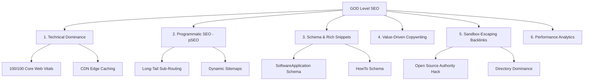

# 🚀 "GOD Level" SEO Strategy for ZeroWebTools

To rank a client-side utility suite like **ZeroWebTools** at the top of search engines as fast as possible, we must bypass traditional slow SEO approaches and execute a high-velocity, technical, and programmatic campaign. 

Because we compete with massive sites like TinyWow, Smallpdf, and CyberChef, our strategy targets **hyper-specific search intent**, **technical speed dominance**, and **automated semantic footprint expansion**.

---

## 🗺️ The 6-Pillar SEO Blueprint



---

## ⚡ Pillar 1: Technical & Core Web Vitals Dominance (The Baseline)
Google ranks websites that render instantly higher, especially in mobile search. Since ZeroWebTools is built on Next.js with **static exports**, we have a massive head start.

### 🛠️ Execution Plan:
1. **Target 100/100 Lighthouse Scores**:
   * Keep DOM sizes small.
   * Serve all static resources (like PDF workers and WASM files) locally from the CDN edge.
   * Keep standard CSS minimal and eliminate render-blocking scripts.
2. **CDN Edge Hosting (Netlify/Vercel/Cloudflare)**:
   * Deploy the build directory (`apps/web/out`) globally via CDN. This reduces Time to First Byte (TTFB) to under 50ms worldwide.
3. **No-JS Compatibility (Static Hydration fallback)**:
   * Ensure search engine crawlers can read the initial text, lists, and headers even if they index the page with JavaScript execution disabled. Next.js static exports handle this automatically.

---

## 🏷️ Pillar 2: Programmatic SEO (pSEO) — Scaling Keywords
Instead of targeting high-competition short-tail terms (e.g., "PDF compress"), we will dynamically generate pages targeting **thousands of ultra-specific, long-tail terms** with lower keyword difficulty.

### 🛠️ Execution Plan:
Create specialized sub-pages under our tools directory. For example, for **Case Converter**, we can programmatically generate sub-routes:
* `/tools/case-converter/camel-case-to-snake-case`
* `/tools/case-converter/convert-text-to-all-caps`
* `/tools/case-converter/capitalize-first-letter-online`

For **JSON Formatter**:
* `/tools/json-formatter/beautify-json-online`
* `/tools/json-formatter/minify-json-for-api`

#### Implementation in Next.js:
Generate these pages dynamically using `generateStaticParams()` to output static HTML. They share the same core tool component, but display custom, localized SEO titles, meta descriptions, and instructional articles tailored exactly to that search query.

---

## 📊 Pillar 3: Structured Data Schema (Winning the SERP Visuals)
Schema markup tells search engines exactly what your page represents, allowing them to show rich snippets (e.g., direct launch buttons, FAQs, and software descriptions) in search results, doubling your click-through rate (CTR).

### 🛠️ Execution Plan:
Inject JSON-LD structured data directly into the `<head>` of each tool page:

#### A. **`SoftwareApplication` Schema**:
Tells Google the tool is an application.
```json
{
  "@context": "https://schema.org",
  "@type": "SoftwareApplication",
  "name": "ZeroWebTools PDF Compressor",
  "operatingSystem": "All",
  "applicationCategory": "BusinessApplication",
  "offers": {
    "@type": "Offer",
    "price": "0",
    "priceCurrency": "USD"
  }
}
```

#### B. **`HowTo` Schema**:
Provides a step-by-step visual tutorial directly on the search engine results page.
```json
{
  "@context": "https://schema.org",
  "@type": "HowTo",
  "name": "How to Compress a PDF offline",
  "step": [
    {
      "@type": "HowToStep",
      "text": "Drag and drop your PDF file into the local sandbox workspace."
    },
    {
      "@type": "HowToStep",
      "text": "Select your desired compression level (Balanced, Extreme, or Lossless)."
    },
    {
      "@type": "HowToStep",
      "text": "Download your compressed PDF instantly without it ever leaving your browser."
    }
  ]
}
```

---

## ✍️ Pillar 4: Value-Driven Content Blocks (Relevancy Signals)
Search engines need semantic keyword depth to understand page context. Clean, developer-centric copy at the bottom of utility pages keeps users on the page and boosts contextual search signals.

### 🛠️ Execution Plan:
* **Current Layout**: Keep using the **`ArticleBlock`** layout (found at the bottom of our pages) to address:
  * **Core Intent**: *"How does client-side PDF compression work?"*
  * **Edge Cases**: *"Are my uploaded files safe?"* (Emphasize the zero-tracking, browser-sandbox context).
  * **FAQ Accordion**: Structured with standard accordion headings so Google easily parses them into search snippets.
* **No-AI Fluff**: Keep the articles highly technical, bulleted, and precise. Google's helpful content algorithms penalize long, generic AI text.

---

## 🔗 Pillar 5: Sandbox-Escaping Growth Hacks (Backlinks & Authority)
A new domain (`zerowebtools.com`) sits in the "Google Sandbox" for 3 to 6 months unless it receives strong domain authority signals. We escape this by leveraging high-authority third-party platforms.

### 🛠️ Execution Plan:
1. **The Open Source Authority Hack**:
   * Point high-authority backlinks from GitHub to the domain.
   * Make your GitHub repository (e.g., `zeeshan1112/zerowebtools`) highly documented, linking back to the live site.
   * Submit the repo to open-source hubs (e.g., standard collections, `awesome-selfhosted`, `alternative-to`).
2. **Direct Directory Submissions**:
   * Submit to developer utility listings:
     * **AlternativeTo** (Profile ZeroWebTools as a privacy-first alternative to TinyWow, iLovePDF, and CyberChef).
     * **Product Hunt** (Schedule a launch to drive traffic spikes, social signals, and backlinks).
     * **Dev.to / Indie Hackers** (Write technical articles detailing *"How I built a WASM-powered PDF converter that costs $0 to run"*).
3. **Tool Listing Directories**:
   * Submit to aggregators like `100builders`, `StartupBase`, and custom developer lists to quickly build foundation backlink profiles (DA 40+).

---

## 🔍 Pillar 6: Automated XML Sitemaps & Search Console
We need to index every programmatic long-tail page the moment it is built.

### 🛠️ Execution Plan:
1. **Programmatic Sitemap**:
   * Configure a Next.js sitemap generator (`app/sitemap.ts`) to read the tools registry and dynamically build `sitemap.xml`.
2. **Fast Google Search Console Verification**:
   * Add the site to Google Search Console via DNS records.
   * Submit the dynamic sitemap immediately.
   * Use index requests for primary tools to ensure crawling starts within 24 hours.
